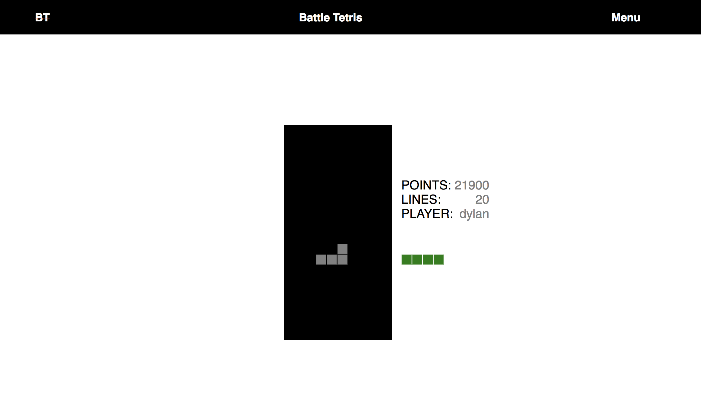

# React Battle Tetris

## Introduction

This is my version of React Tetris.

## Technologies

Battle Tetris is written using React, Javascript, and HTML/CSS on the frontend. It utilizes Lodash library for the matrix creation as well. On the backend it runs on Mongoose and had users stored in an mLab database.

## Links

[Trello](https://trello.com/b/pRFTM25Y/battle-tetris)

[Demo](https://obscure-tundra-14175.herokuapp.com/)

## Unsolved Problems

I am still currently fixing and working out the scoring of the game.

## Future

In the future I would like to persist a User's top score and allow anyone, logged in or not, to view the scores. I would like the styling to have a little more and not be as minimal as it currently is.

Also there will be a battle mode that allows to players to play side by side. When one player completes a line of blocks it will push that line to the other players board. Eventually one of the players will be defeated.

